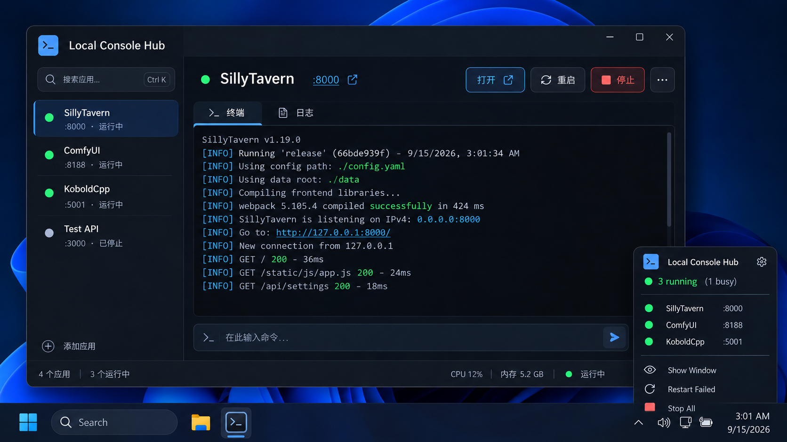

# Local Console Hub UI 制作规范（V1 初版）

> 本文档以 `assets/ui/ui-v1-preview.png` 为 **初版 UI 定稿参考图**。  
> 目标不是逐像素照搬，而是在后续实现、分包、交给其他 AI 或设计/前端开发时，确保 **风格、信息层级、布局意图与交互重点不跑偏**。

---

## 1. 版本定位

- **版本名称**：V1 Initial UI
- **状态**：初版定稿
- **适用范围**：桌面端主窗口 + Windows 托盘菜单
- **平台优先级**：Windows 优先
- **对应目标**：为 Local Console Hub 提供一套清晰、轻量、稳定的初版桌面 UI 方向

该版本的核心不是“展示很多信息”，而是：

1. **让用户一眼看出当前在管理哪些本地应用/终端**；
2. **让最常用操作始终在手边**；
3. **让终端成为主角，而不是被很多状态卡片压缩**；
4. **让托盘成为常驻入口，主窗口成为操作面板**。

---

## 2. 总体设计原则

### 2.1 简洁优先
- 不为了“看起来功能很多”而堆叠信息块；
- 不重复展示同一信息；
- 低频信息默认隐藏，而不是长期占位；
- 主界面优先服务“选择会话 + 看终端 + 执行动作”。

### 2.2 终端优先
- 终端/日志区域应是主视觉中心；
- 不能让侧栏、信息卡、统计面板挤压主终端；
- 对于交互式会话，输入区域必须始终清晰可见。

### 2.3 语义清晰
- 使用 **状态圆点 + 颜色** 来表达状态；
- 左侧列表不堆叠多余图标；
- 按钮命名直接、明确：如“打开 / 重启 / 停止”；
- 状态表达要服务操作，而不是做装饰。

### 2.4 轻量克制
- 整体视觉应偏沉稳、专业、工具化；
- 避免“花哨仪表盘感”；
- 减少无意义插画和重复图标；
- 动效从简，优先低干扰。

---

## 3. 视觉风格基线

### 3.1 整体风格
- 深色主题为主；
- 现代 Windows 桌面工具感；
- 玻璃感 / 半透明感可以轻微存在，但不得影响信息识别；
- 整体气质：**克制、清晰、稳重、略有科技感**。

### 3.2 应用图标
- 使用当前定稿中的 **蓝色方形终端图标** 作为应用主图标；
- 左上角应用名称前使用该图标；
- 任务栏图标使用该图标；
- 托盘弹出面板左上也使用该图标。

### 3.3 左侧会话状态表达
- **不使用应用小图标**；
- 只使用 **圆点 + 颜色** 表达状态；
- 名称、端口、简短状态/说明即可；
- 避免像应用启动器那样给每项加拟物图标。

状态建议：
- 绿色：运行中 / 正常
- 黄色：忙碌 / 部分异常 / 处理中
- 灰色：已停止 / 未启动
- 红色：错误 / 失败 / 不可用
- 蓝色不作为业务状态色，优先用于交互高亮

---

## 4. 信息架构

V1 主界面分为 3 个区域：

1. **左侧会话列表**
2. **上方操作与标题区**
3. **主终端工作区**

底部允许保留一条轻量状态栏。

### 4.1 左侧会话列表（必须）
承担：
- 显示当前受管会话；
- 快速切换会话；
- 显示最基础状态；
- 提供“添加应用”入口。

每个会话项建议包含：
- 状态圆点
- 名称
- 端口（若有）
- 简短状态文案（如“运行中 / 已停止”）

不应在左侧堆叠：
- 应用 logo
- 详细健康信息
- 大段描述
- 多组动作按钮

### 4.2 上方操作与标题区（必须）
承担：
- 当前会话名称
- 端口 / 链接入口
- 高频操作按钮

建议始终可见的按钮：
- 打开
- 重启
- 停止
- 更多

说明：
- “打开”用于打开对应 WebUI / 本地网页 / 面板
- “更多”用于承载低频操作，如打开目录、复制地址、查看详情等
- 避免在主界面上长期挂出大量按钮

### 4.3 主终端工作区（必须）
这是主角。

建议结构：
- 顶部二级标签：`终端`、`日志`
- 中间大面积输出区
- 底部输入区

要求：
- 终端输出区域尺寸尽可能大；
- 输入区必须可见；
- 即使当前展示的是服务输出，也应为未来交互会话保留输入能力；
- “日志”不应在页面内重复出现三处以上。

### 4.4 底部状态栏（推荐）
保留最少信息即可：
- 应用总数
- 运行中数量
- 当前简单资源概览（如 CPU / 内存）
- 当前选中会话状态

底部状态栏的目标是“轻量扫读”，不是“次级控制面板”。

---

## 5. 当前定稿中已明确的取舍

以下内容属于已经讨论后的定稿意图，后续不要轻易改回去。

### 5.1 左侧去除应用图标
原因：
- 会让侧栏看起来太花；
- 弱化了“状态切换列表”的工具属性；
- 让真正该关注的文字信息更短。

### 5.2 去除右侧常驻大信息卡
原因：
- 长期占位但使用频率不高；
- 端口以外的信息不值得一直常驻；
- 压缩了主终端宽度。

如果需要更多详情，应通过：
- “更多”菜单
- 单独详情抽屉
- 二级面板
- 悬浮信息

来按需展开，而不是一直挂在右边。

### 5.3 保留顶部搜索框，但不强调复杂筛选
搜索框可保留，用于后续扩展，但 V1 不要在顶栏塞入太多筛选器。

### 5.4 托盘样式按当前定稿执行
托盘弹出面板保留：
- 应用图标与标题
- `3 running (1 busy)` 这样的总状态
- 关键运行项列表
- Show Window
- Restart Failed
- Stop All
- Exit

托盘的作用是：
- 快速查看
- 快速回到主界面
- 做少量全局控制

不是把整个主界面缩小复制一遍。

### 5.5 任务栏图标按定稿替换
任务栏中的 Local Console Hub 图标使用最终定稿中的终端图标。

---

## 6. 组件规范

## 6.1 主窗口
- 圆角桌面窗口
- 深色背景
- 顶部保留原生窗口控制按钮
- 顶栏简洁，不加入额外导航图标

## 6.2 侧栏
- 固定宽度，宽度中等偏窄
- 仅承载：应用标题、搜索、会话列表、添加应用、底部统计
- 不要再插入 Settings / Logs / About 一级导航（V1 里不需要）

## 6.3 会话项
- 选中态：柔和蓝色高亮背景
- 未选中态：透明 / 深色背景
- Hover 态：轻微提亮
- 状态圆点：位于名称左侧
- 端口与状态信息位于第二行或同一行次级文字

## 6.4 主操作按钮
- 主要按钮：蓝色描边或高亮（如“打开”）
- 危险按钮：红色（如“停止”）
- 次级按钮：深色描边（如“重启”）
- 更多按钮：收纳低频操作

建议主按钮数量控制在 3~4 个以内。

## 6.5 标签切换
- 仅保留 `终端` / `日志`
- 默认进入 `终端`
- 若后续增加 `运行记录 / 详情`，优先放到更多层级，不要默认常驻

## 6.6 终端区
- 深色背景
- 边框轻微可见
- 支持长文本滚动
- 默认应支持彩色日志高亮
- 光标与输入区可清晰辨认

## 6.7 输入区
- 独立于输出区下方
- 清晰提示“在此输入命令...”
- 右侧发送按钮或提交操作可以保留
- 未来真实实现时，应支持快捷键提交与标准终端输入语义

## 6.8 托盘弹出面板
- 尺寸小而明确
- 信息密度适中
- 顶部为标题和总体状态
- 中部为关键运行项
- 底部为全局操作

---

## 7. 排版与层级建议

### 7.1 文字层级
- 一级：应用名 / 当前会话名
- 二级：状态、端口、按钮
- 三级：底部统计、说明文字、次级状态

### 7.2 内容密度
- 主界面避免说明文案过多；
- 任何一块区域若用户第一次看过去 3 秒内读不完，说明可能太满；
- 把“详情”推迟到需要时再展开。

### 7.3 重复信息控制
不要在同一个界面重复出现过多次：
- `logs / 日志`
- `running / 运行中`
- 同一端口
- 同一状态描述

原则：**一个信息在一个层级里出现一次即可。**

---

## 8. 颜色与状态建议（实现参考）

以下为方向性建议，允许工程实现时微调：

- 背景主色：近黑蓝灰
- 面板背景：比主背景略亮
- 边框：低对比度浅蓝灰 / 半透明灰
- 主强调色：蓝色
- 成功 / 运行中：绿色
- 忙碌 / 警示：黄色或黄橙色
- 停止 / 非活跃：灰色
- 危险 / 停止动作：红色

要求：
- 不依赖颜色作为唯一信息来源，仍需配合文字；
- 颜色主要服务状态识别和交互反馈，不用于装饰性堆叠。

---

## 9. 托盘规范

托盘部分以当前定稿图为标准方向。

### 9.1 托盘面板必须包含
- 应用图标
- 标题 `Local Console Hub`
- 设置入口（可选图标按钮）
- 总状态摘要，如 `3 running (1 busy)`
- 当前关键运行项（不要求展示所有停止项）
- Show Window
- Restart Failed
- Stop All
- Exit

### 9.2 托盘面板不建议包含
- 大量统计图
- 多级折叠菜单
- 详细日志
- 复杂筛选
- 终端输出预览

### 9.3 行为意图
托盘是：
- 常驻入口
- 轻量概览
- 快速控制

主窗口才是：
- 详细查看
- 终端交互
- 添加与管理会话

---

## 10. 后续扩展时的 UI 边界

未来可能加入：
- 详情抽屉
- 设置页
- 会话配置编辑器
- 日志搜索
- 运行记录
- 健康检查细节

但 V1 的主界面不要因此提前预留大量显性入口。

扩展原则：
- **默认界面保持简洁**；
- **扩展能力通过次级入口展开**；
- **不要牺牲终端区域大小**。

---

## 11. 对其他 AI / 设计协作者的约束说明

如果把任务分发给其他 AI 或协作者，请附带以下要求：

1. **以本文和 `ui-v1-preview.png` 为准，不要自行加入花哨的应用图标列表；**
2. **不要恢复右侧大面积常驻信息栏；**
3. **不要把主界面做成复杂 Dashboard；**
4. **不要弱化终端区域；**
5. **托盘风格按当前定稿延续；**
6. **任务栏图标使用定稿中的终端图标；**
7. **能隐藏的信息不要长期显示；**
8. **允许补充细节，但不能改变“简洁、终端优先、侧栏轻量”的核心意图。**

---

## 12. 建议仓库放置位置

建议加入到仓库中：

- `docs/UI_STYLE_GUIDE.md`
- `assets/ui/ui-v1-preview.png`

如果后续版本继续迭代，可扩展为：

- `assets/ui/ui-v2-preview.png`
- `docs/UI_CHANGELOG.md`
- `docs/UI_COMPONENT_NOTES.md`

---

## 13. 定稿声明

**当前 V1 初版 UI 定稿以 `assets/ui/ui-v1-preview.png` 为准。**

后续如有修改，应明确标记为：
- V1.1 调整
- V2 方向探索
- 实现偏差修正

不要在未记录的情况下，逐步偏离本稿。
